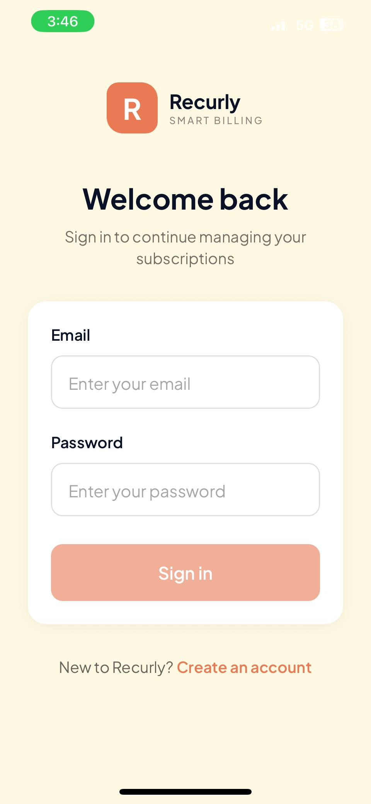
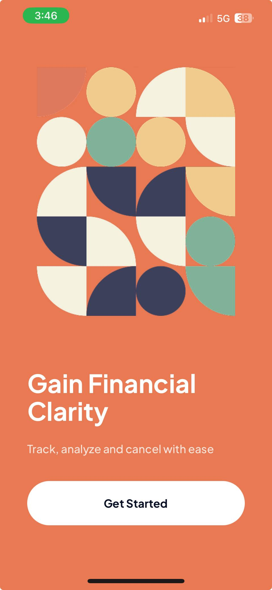
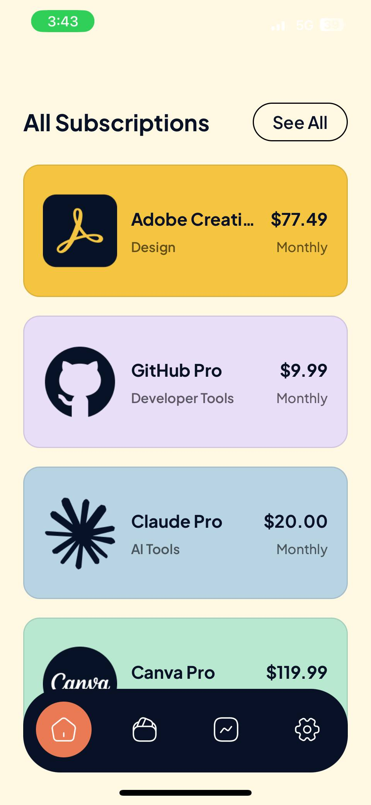
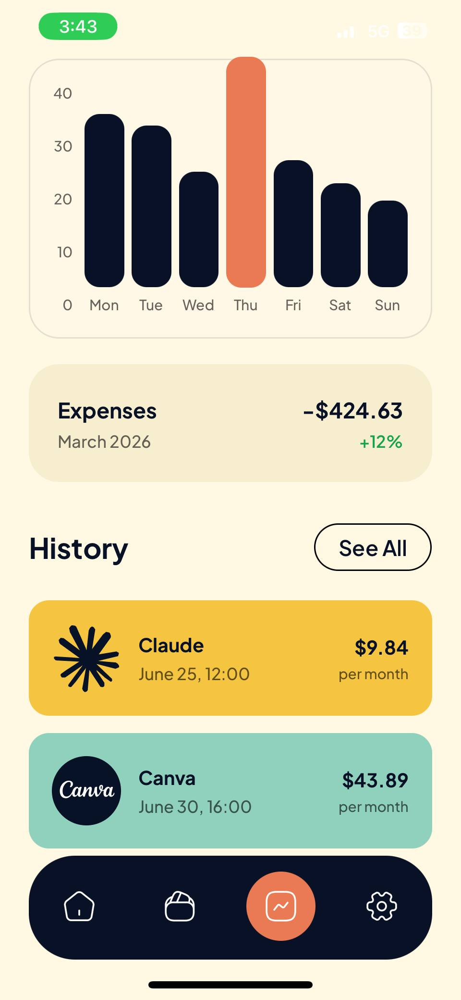
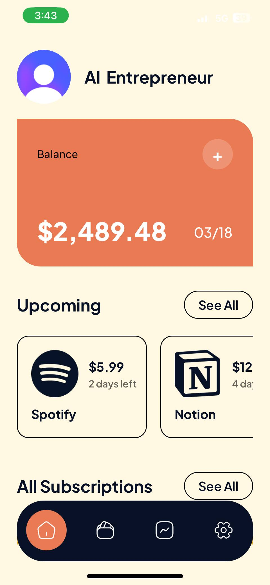

# Recurrly

A mobile subscription tracker built with React Native and Expo. Track, analyze, and manage all your recurring subscriptions in one place — see upcoming renewals, monitor spending insights, and stay on top of your finances.

## Screenshots

<table>
  <tr>
    <td></td>
    <td></td>
    <td></td>
    <td></td>
    <td></td>
  </tr>
  <tr>
    <td align="center">Auth</td>
    <td align="center">Home</td>
    <td align="center">Subscriptions</td>
    <td align="center">Insights</td>
    <td align="center">Dashboard</td>
  </tr>
</table>

## Tech Stack

| Layer         | Technology                              |
| ------------- | --------------------------------------- |
| Framework     | React Native 0.81 + Expo SDK 54        |
| Router        | Expo Router v6 (file-based routing)     |
| Styling       | NativeWind v5 + Tailwind CSS v4         |
| Auth          | Clerk (`@clerk/expo`)                   |
| State         | Zustand v5                              |
| Language      | TypeScript 5.9 (strict mode)            |
| Fonts         | Plus Jakarta Sans (via expo-font)       |

## Getting Started

### Prerequisites

- Node.js 18+
- npm or yarn
- [Expo Go](https://expo.dev/go) app on your device, or an Android/iOS emulator

### Setup

1. **Clone the repo**

   ```bash
   git clone <repo-url>
   cd recurrly
   ```

2. **Install dependencies**

   ```bash
   npm install
   ```

3. **Configure environment variables**

   Create a `.env` file in the project root:

   ```
   EXPO_PUBLIC_CLERK_PUBLISHABLE_KEY=pk_test_your_key_here
   ```

   Get your publishable key from the [Clerk Dashboard](https://dashboard.clerk.com).

4. **Start the app**

   ```bash
   npx expo start
   ```

   Scan the QR code with Expo Go, or press `a` for Android emulator / `i` for iOS simulator.

## Project Structure

```
app/
  _layout.tsx          # Root layout with Clerk provider & auth guard
  onboarding.tsx       # Welcome / landing screen
  (auth)/              # Sign-in, sign-up, email verification
  (tabs)/              # Main app tabs (home, subscriptions, insights, settings)
components/            # Reusable UI components
constants/             # Theme colors, icons, images, static data
lib/                   # Utilities & validation helpers
store/                 # Zustand state management
```
